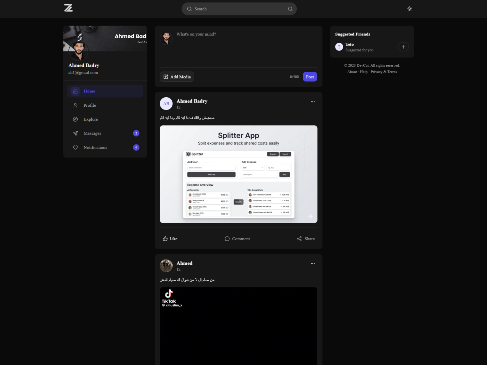
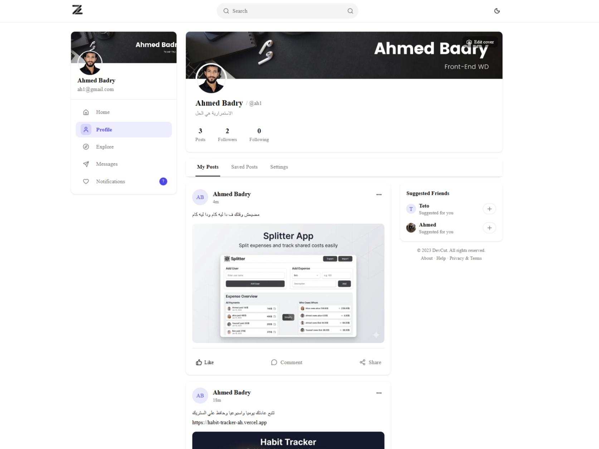
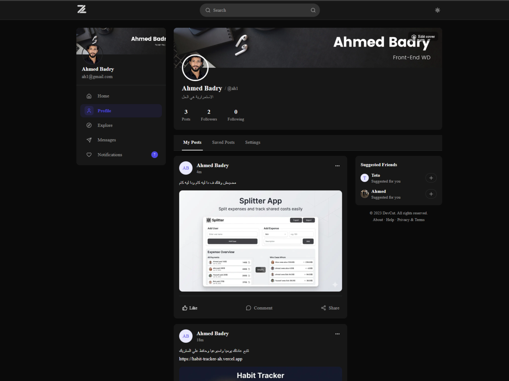
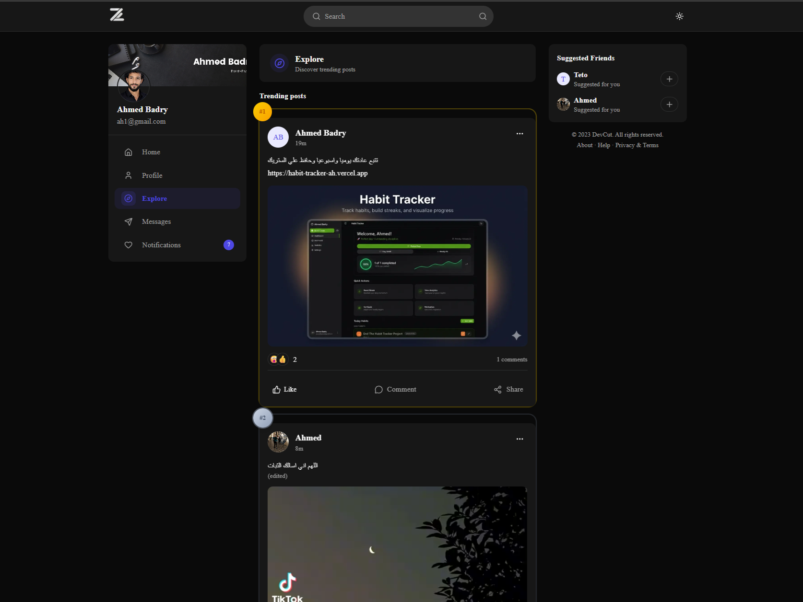
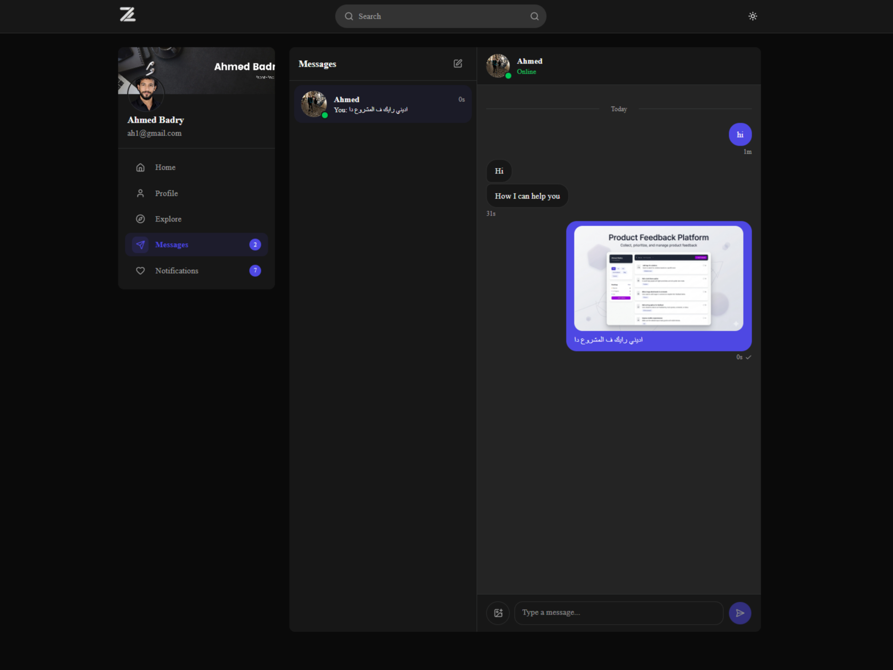
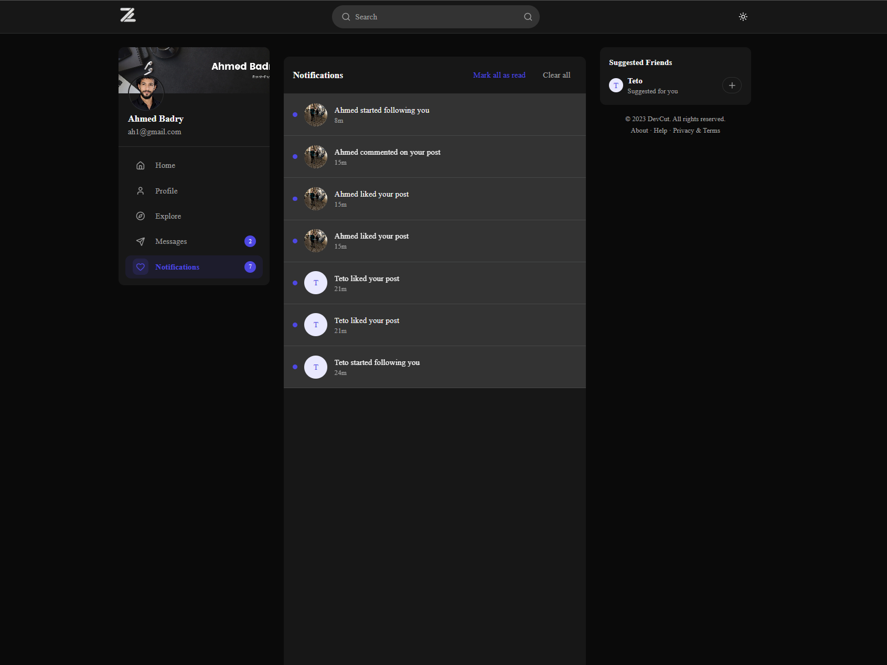
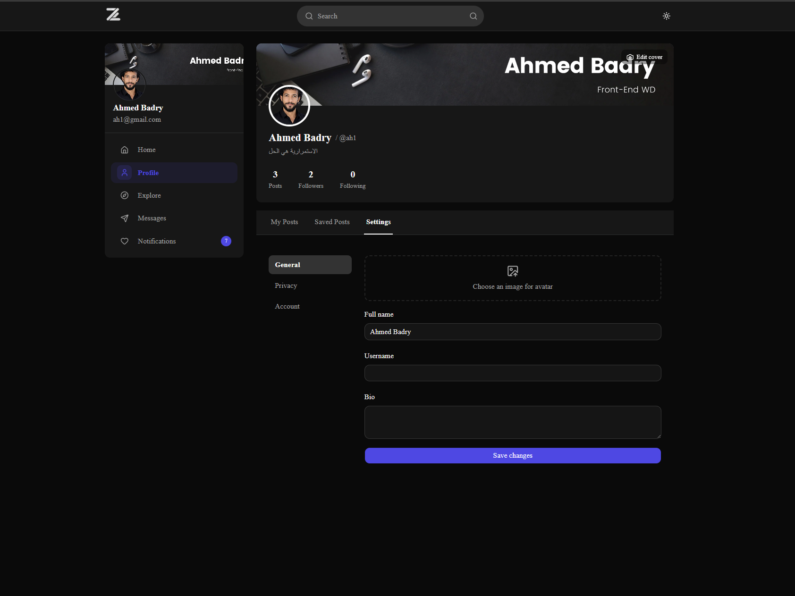
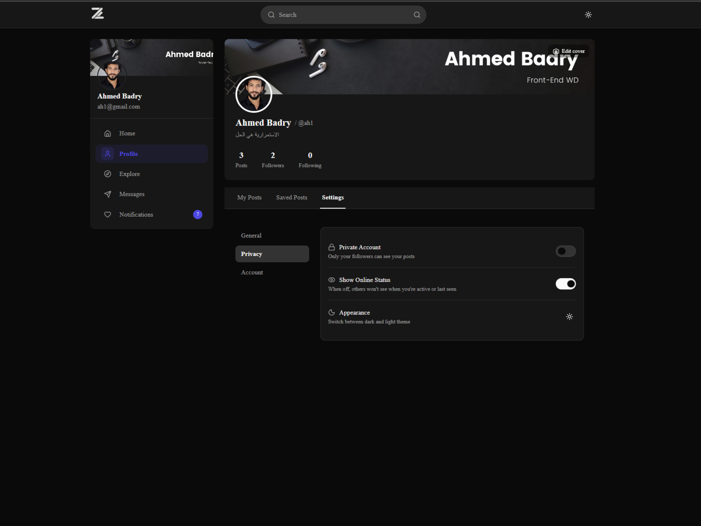

<div align="center">


# Z — Social Platform

**A full-stack social networking web application built with modern technologies.**  
Real-time feeds · Direct messaging · Notifications · Rich profiles · Dark & Light mode

[](https://nextjs.org/)
[](https://www.typescriptlang.org/)
[](https://convex.dev/)
[](https://tailwindcss.com/)
[](LICENSE)

</div>

---

## 📸 Screenshots

<table>
  <tr>
    <td align="center"><b>Feed (Dark)</b></td>
    <td align="center"><b>Feed (Light)</b></td>
  </tr>
  <tr>
    <td></td>
    <td></td>
  </tr>
  <tr>
    <td align="center"><b>Profile — My Posts</b></td>
    <td align="center"><b>Explore & Trending</b></td>
  </tr>
  <tr>
    <td></td>
    <td></td>
  </tr>
  <tr>
    <td align="center"><b>Direct Messages</b></td>
    <td align="center"><b>Notifications</b></td>
  </tr>
  <tr>
    <td></td>
    <td></td>
  </tr>
  <tr>
    <td align="center"><b>Settings — General</b></td>
    <td align="center"><b>Settings — Privacy</b></td>
  </tr>
  <tr>
    <td></td>
    <td></td>
  </tr>
</table>

---

## ✨ Features

### 🔐 Authentication

- Email & password sign-up / sign-in
- Google OAuth (one-click login)
- Magic link via email
- OTP verification flow
- Forgot password & reset password
- Secure sessions via **Better Auth**

### 📰 Feed & Posts

- Create posts with text, images, or videos
- Edit and delete your own posts
- Real-time feed from people you follow
- **6 emoji reactions** — Like, Love, Haha, Wow, Sad, Angry
- Save posts to your personal bookmark list
- Comment and reply on any post (nested threads)
- Mention users with `@username` in posts and comments
- Full-text search across all posts

### 👤 Profile

- Custom avatar upload
- Cover image with inline editing
- Username, display name, and bio
- Public posts tab, saved posts tab, and settings tab
- Follow / Unfollow with **follow request** support for private accounts
- Follower & following counts

### 🔒 Privacy & Settings

- **Private account** toggle — only followers can see your posts
- **Online status** visibility toggle
- Appearance switcher (dark / light theme)
- Account management (delete account)

### 🔍 Explore

- Discover trending posts ranked by engagement
- Search for users by username
- Suggested friends panel

### 💬 Direct Messages

- Real-time 1-to-1 chat powered by Convex
- Image sharing in chat
- Reply to specific messages
- **6 message reactions**
- Online presence indicator (green dot)
- Read receipts (✓✓)
- Typing indicator

### 🔔 Notifications

- Real-time notifications for: likes, comments, replies, follows, follow requests, follow accepts, and mentions
- Mark all as read / clear all
- Swipe-to-delete individual notifications with **Undo** toast
- Unread badge count on the nav icon

---

## 🛠 Tech Stack

| Layer                       | Technology                 | Purpose                                               |
| --------------------------- | -------------------------- | ----------------------------------------------------- |
| **Framework**               | Next.js 16 (App Router)    | Routing, Server Components, SSR                       |
| **Language**                | TypeScript 5 (strict)      | End-to-end type safety                                |
| **Backend + DB + Realtime** | Convex                     | Database, queries, mutations, real-time subscriptions |
| **Authentication**          | Better Auth                | Sessions, OAuth, magic link, OTP                      |
| **Styling**                 | Tailwind CSS v4            | Utility-first styling                                 |
| **UI Components**           | shadcn/ui + Radix UI       | Accessible, unstyled primitives                       |
| **File Uploads**            | UploadThing                | Image & video uploads                                 |
| **Email**                   | Resend                     | Transactional emails (OTP, magic link)                |
| **Forms**                   | React Hook Form + Zod      | Form state and schema validation                      |
| **Client State**            | Zustand                    | UI state & optimistic updates                         |
| **URL State**               | nuqs                       | Search params, active tabs                            |
| **Animations**              | Motion (Framer Motion v12) | Micro-interactions                                    |

---

## 📁 Project Structure

```
social-platform/
├── convex/                     ← All backend logic
│   ├── schema.ts               ← Database tables & indexes
│   ├── posts.ts                ← Posts CRUD + feed algorithm
│   ├── comments.ts             ← Nested comments & likes
│   ├── likes.ts                ← Post reactions
│   ├── follows.ts              ← Follow system + requests
│   ├── messages.ts             ← Real-time DMs + reactions
│   ├── notifications.ts        ← Notification engine
│   ├── users.ts                ← User profiles & presence
│   ├── saves.ts                ← Bookmarks
│   ├── search.ts               ← Full-text search
│   └── _generated/             ← Auto-generated (do not edit)
│
├── src/
│   ├── app/
│   │   ├── (auth)/             ← Public pages: login, signup, otp…
│   │   ├── (main)/             ← Protected pages: feed, profile, messages…
│   │   └── api/                ← Next.js API routes (auth, uploadthing)
│   │
│   ├── components/
│   │   ├── ui/                 ← shadcn base components
│   │   ├── layout/             ← Navbar, Sidebar, RightPanel, MobileTabBar
│   │   ├── feed/               ← PostCard, PostComposer, CommentItem…
│   │   ├── profile/            ← ProfileHeader, SettingsSidebar, tabs
│   │   ├── messages/           ← ConversationList, ChatWindow, MessageBubble
│   │   ├── notifications/      ← NotificationItem, NotificationBell
│   │   └── shared/             ← Skeletons, EmptyState, ConfirmDialog…
│   │
│   ├── hooks/                  ← Custom React hooks
│   ├── lib/                    ← auth.ts, uploadthing.ts, resend.ts, utils.ts
│   ├── stores/                 ← Zustand stores
│   └── types/                  ← TypeScript interfaces & types
│
├── public/                     ← Static assets (logo, icons, manifest)
├── screenshots/           ← App screenshots for documentation
├── .env.example                ← Environment variable template
└── AI_RULES.md                 ← AI assistant coding rules
```

---

## 🚀 Getting Started

### Prerequisites

- Node.js 18+
- A [Convex](https://convex.dev/) account
- A [UploadThing](https://uploadthing.com/) account
- A [Resend](https://resend.com/) account
- A Google Cloud project (for OAuth)

### 1. Clone the repository

```bash
git clone https://github.com/your-username/social-platform.git
cd social-platform
```

### 2. Install dependencies

```bash
npm install
```

### 3. Set up environment variables

Copy the example file and fill in your credentials:

```bash
cp .env.example .env.local
```

```env
# Convex
CONVEX_DEPLOYMENT=dev:your-deployment-name
NEXT_PUBLIC_CONVEX_URL=https://your-deployment.convex.cloud
NEXT_PUBLIC_CONVEX_SITE_URL=https://your-deployment.convex.site

# Auth
BETTER_AUTH_SECRET=your-secret-here
BETTER_AUTH_URL=http://localhost:3000
NEXT_PUBLIC_BETTER_AUTH_URL=http://localhost:3000
NEXT_PUBLIC_SITE_URL=http://localhost:3000

# File Uploads
UPLOADTHING_TOKEN=your-uploadthing-token

# Email
RESEND_API_KEY=your-resend-api-key
EMAIL_FROM=noreply@yourdomain.com

# Google OAuth
GOOGLE_CLIENT_ID=your-google-client-id
GOOGLE_CLIENT_SECRET=your-google-client-secret
```

### 4. Initialize Convex

```bash
npx convex dev
```

This will deploy your schema and backend functions and keep them synced during development.

### 5. Run the development server

```bash
npm run dev
```

Open [http://localhost:3000](http://localhost:3000) in your browser.

---

## 🗺 Routes

### Public Routes

| Route              | Page                                  |
| ------------------ | ------------------------------------- |
| `/login`           | Sign in with email/password or Google |
| `/signup`          | Create a new account                  |
| `/login/email`     | Magic link login                      |
| `/forgot-password` | Request a password reset              |
| `/reset-password`  | Set a new password                    |
| `/verify-otp`      | Enter OTP code                        |
| `/check-inbox`     | Email sent confirmation               |

### Protected Routes

| Route                       | Page                             |
| --------------------------- | -------------------------------- |
| `/`                         | Home feed                        |
| `/explore`                  | Trending posts & search          |
| `/profile`                  | Your posts                       |
| `/profile/saved`            | Saved posts                      |
| `/profile/settings/general` | Edit avatar, name, username, bio |
| `/profile/settings/privacy` | Private account, online status   |
| `/profile/settings/account` | Danger zone (delete account)     |
| `/messages`                 | Direct messages                  |
| `/notifications`            | Activity notifications           |

---

## 🗄 Database Schema

The Convex schema covers 12 tables:

| Table              | Purpose                                            |
| ------------------ | -------------------------------------------------- |
| `users`            | Core user identity (name, email, avatar)           |
| `userProfiles`     | Extended profile (bio, username, privacy settings) |
| `userPresence`     | Online status & typing indicators                  |
| `posts`            | Post content, media, authorship                    |
| `comments`         | Nested comments with parent reference              |
| `likes`            | Post reactions (6 types)                           |
| `commentLikes`     | Comment reactions                                  |
| `saves`            | Bookmarked posts per user                          |
| `follows`          | Follower → Following relationships                 |
| `followRequests`   | Pending / accepted / rejected follow requests      |
| `messages`         | DM content, read status, reply threading           |
| `messageReactions` | Emoji reactions on messages                        |
| `notifications`    | All notification types with read state             |

---

## 🏗 Build for Production

```bash
npm run build
npm start
```

The build step runs `npx convex codegen` automatically before compiling Next.js, ensuring all generated types are up to date.

---

## 🤝 Contributing

1. Fork the repository
2. Create a feature branch: `git checkout -b feature/your-feature`
3. Commit your changes: `git commit -m 'feat: add your feature'`
4. Push to the branch: `git push origin feature/your-feature`
5. Open a Pull Request

Please read `AI_RULES.md` before contributing — it defines the coding conventions, folder structure, and tech stack constraints that all contributors (human and AI) must follow.

---

## 📄 License

This project is licensed under the MIT License. See the [LICENSE](LICENSE) file for details.

---

<div align="center">
  <sub>Built with ❤️ using Next.js, Convex, and TypeScript</sub>
</div>
